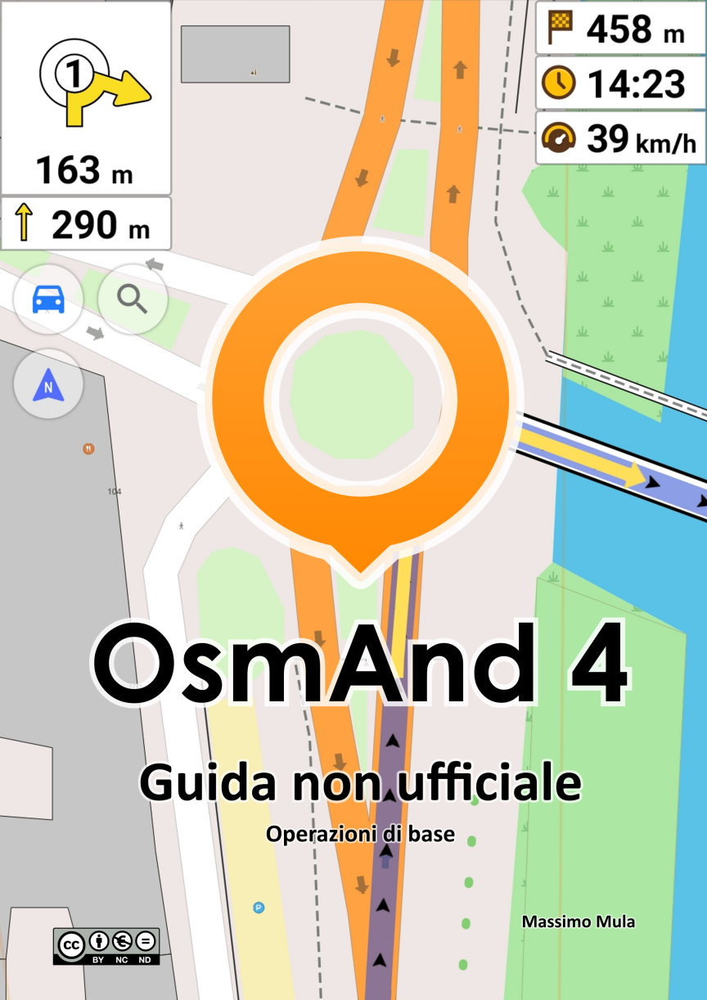

# GuidaOsmand
Guida **<u>non ufficiale</u>** a OsmAnd, l'app di cartografia e navigazione per Android e iOS -- In Italiano! 

   

La storia di questo documento è iniziata molto tempo fa, raccogliendo e catalogando le tante informazioni che ho avuto modo di
scambiare, sparse senza un ordine ben preciso tra forum, email privata, chat e file dimenticati negli anfratti più
remoti dei miei hard disk; Una prima versione ha visto la luce nel 2015, quando OsmAnd era alla versione 1.9.5 ed
era decisamente meno intuitivo da usare di quanto non sia ora.

Oggi la Guida vorrebbe essere un aiuto per gli utenti meno esperti a prendere confidenza con OsmAnd, di
consultazione rapida (spero) ma soprattutto in Italiano!
Non vuole essere un manuale d’istruzioni completo: per illustrare tutte le funzioni nei minimi dettagli esiste già la
documentazione ufficiale, che è davvero esaustiva, ben fatta e merita di certo la consultazione... purtroppo, però, è
scritta solo in lingua Inglese.

Anche se oggi tante persone conoscono più o meno bene quella lingua, rimane pur sempre un disagio il
dover interpretare quelle istruzioni, magari mentre si ha fretta o ci si trova sotto pressione; Le soluzioni proposte qui non sono forse ottimali ma in certi casi, tra “una soluzione generica e superficiale” e “nessuna soluzione a portata di mano” è ancora meglio la prima!

 

Alcuni link utili:

  - OsmAnd: &nbsp;&nbsp;&nbsp;&nbsp; http://www.osmand.net/
  
  - Documentazione ufficiale (in Inglese): &nbsp;&nbsp;&nbsp;&nbsp; http://www.osmand.net/docs/intro

 
 

   

I have created this document to help Italian people, like me, moving their first steps with OsmAnd.

For information about the use of the app you can easily refer to the official documentation, which is actually very detailed and well-written, at http://www.osmand.net/docs/intro.

There is currently no English version of this guide, but who knows, maybe you can fork this repository in the near future. :-)

 

L'immagine di copertina è stata creata dall'Autore, basandosi su cartografia OpenStreetMap - (C) Openstreetmap Contributors; Alcune delle icone utilizzate in questa pagina sono state realizzate da <a href="https://freebiesbug.com/psd-freebies/100-flat-flag-psd-icons" target="_blank">Muharrem Şenyıl</a>  e sono liberamente disponibili:&nbsp;&nbsp;&nbsp;&nbsp; https://freebiesbug.com/psd-freebies/100-flat-flag-psd-icons

 
 

The cover picture is by the Author and based on OpenStreetMap Cartography - (C) Openstreetmap Contributors; Some of the icons used in this page are by <a href="https://commons.wikimedia.org/wiki/User:Zoologist" target="_blank">Zoologist</a>  and freely available on Wikimedia Commons: &nbsp;&nbsp;&nbsp;&nbsp; https://commons.wikimedia.org/w/index.php?search=zoologist+blackout&title=Special:MediaSearch&go=Go&type=image

 
 

