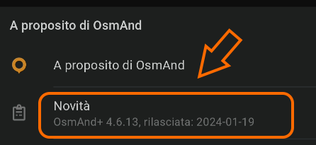

# SEGNALARE BUG E RICHIEDERE NUOVE FUNZIONI

<i><b>
Ho scoperto un problema nel funzionamento di OsmAnd. Posso contattare gli sviluppatori per segnalarlo?</b></i>

Certo! E' sempre utile segnalare gli errori.
OsmAnd è un progetto Open: tutte le segnalazioni ed i suggerimenti da parte degli utenti sono sempre bene
accetti. 

Tutte le segnalazioni di malfunzionamento ed i suggerimenti vengono raccolti attraverso la pagina web
ufficiale: https://github.com/osmandapp/OsmAnd/issues

Perchè siano utili, però, è necessario che essi siano formulati in modo chiaro ed inviati attraverso il
canale più adatto. 

___
 

<i><b>
Ho notato che al programma manca una funzione che credo sarebbe molto utile. Posso richiederla?</i></b>

Anche in questo caso, sì; La pagina di riferimento è la medesima già citata nella risposta precedente. In
questo caso, però, se non si tratta di un errore del funzionamento, bisogna aprire un ticket di “ Feature
Request” invece di un “Bug Report”.

___
 

<i><b>
Vorrei aprire una segnalazione allo sviluppo ma non ho mai usato GitHub, cosa devo fare?</b></i>

# Ecco alcune istruzioni di base:
- Innanzitutto bisogna aprire la pagina web https://github.com/osmandapp/OsmAnd/issues con un
qualunque browser: funziona anche da smartphone e tablet ma sarebbe meglio usare un computer, se
possibile. Eh si, è tutta in inglese...
  
  <b>SUGGERIMENTO</b>: _Il team di sviluppo è internazionale e la lingua da usare in tutte
le comunicazioni con esso è l'Inglese: non serve conoscerlo alla perfezione, basta
che il contenuto della segnalazione sia comprensibile e riporti i sintomi
riscontrati. Può anche essere utile impostare (temporaneamente) OsmAnd in
modo che presenti l'interfaccia utente in lingua inglese, così da poter indicare
l'esatta denominazione dei menu e delle opzioni da selezionare._
  
- Prima di aprire una segnalazione di qualunque tipo è sempre bene sfogliare l'elenco di quelle già
presenti: non è raro, infatti, che lo stesso problema sia già stato riportato da altri utenti.

- Se si possiede già un account GitHub, fare click sul pulsante Sign in (“Accedi”), diversamente, cliccare sul
pulsante Sign up (“Registrati”) e seguire le indicazioni per la creazione di un nuovo account.

- Una volta eseguito l'accesso, fare click sul pulsante New issue ; Scegliere quindi il tipo di segnalazione da aprire, in
particolare:
  → Support request per richiedere un suggerimento;
  → Bug report per segnalare un errore nell'applicazione;
  → Routing report per segnalare un errore nel calcolo di un itinerario;
  → Feature request per proporre una nuova funzione.
  

  
- Fare click sul corrispondente pulsante _"Get started"_ per proseguire.

- Una volta entrati nella sezione _Bug Report_, verrà mostrato un modulo con alcuni campi già predisposti. 
  Si raccomanda di compilare con attenzione almeno quelli elencati di seguito:

  - _**Title**: _
  Breve descrizione del problema, che aiuti chi analizza il bug ad assegnargli la categoria più adatta. Non è necessario
dilungarsi in spiegazioni, quando si compila questo campo, l'importante è essere concisi.
  
  - _**Description**: _
  Qui si può descrivere meglio problema, ad esempio spiegando cosa si stava facendo quando esso si è verificato ed i sintomi coi quali si
è manifestato.
  
  - _**How to reproduce?** _
  Questa sezione è molto importante per lo sviluppatore, perché può aiutarlo a
riprodurre l'errore per poterlo verificare di persona. È importante indicare con precisione le operazioni
da compiere per portare il programma all'errore, indicando con esattezza anche quali opzioni di
configurazione sono state selezionate, e con quale ordine.
  
  - _**Your Environment:**_
  Specificare qui la versione di OsmAnd nella quale si è trovato il problema (è sempre bene verificare che l'errore sia presente nella versione rilasciata più di recente), la versione del sistema operativo utilizzato e marca/modello esatto del dispositivo: anche se può sembrare strano, a volte un bug si verifica solo in particolari versioni del software o con uno specifico modello di dispositivo.
  
   
   
  
  
  
   
   
   
  
 # IMPORTANTE:   
 
    
Lo sviluppatore ha bisogno di conoscere <u>esattamente</u> il numero di versione dell' app nella quale si è osservato il problema. Tale numero si può reperire facilmente nel menu  → Aiuto → A proposito di OsmAnd → Novità. 
    
    Indicare “la versione più recente” o “quella rilasciata la settimana scorsa” non è utile a nessuno.
    

   
   
   
  
Al link seguente si può trovare un esempio di come dovrebbe essere compilato un bug-report:
https://github.com/osmandapp/OsmAnd/issues/14713
  
  
