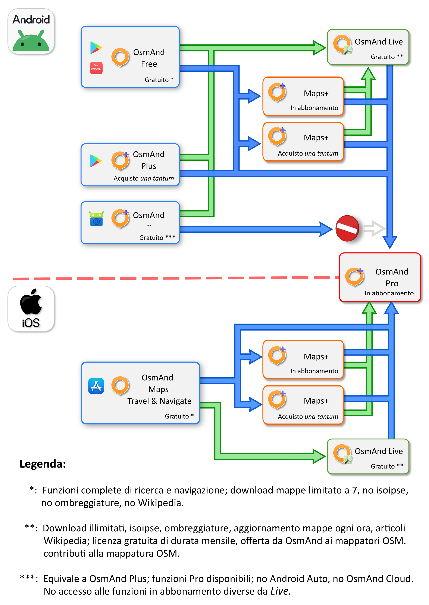

# I servizi aggiuntivi di OsmAnd: Cloud, Start, Live e Pro

## OsmAnd Cloud

_**Cos'è OsmAnd Cloud?**_

**OsmAnd Cloud è un sistema di storage** (immagazzinamento dati) online introdotto dai creatori di OsmAnd a partire dalla versione 4.3: gli utenti dell'app se ne possono servire per salvare su un server la configurazione dell'app, i tracciati gpx, le mappe, le note, ecc.

 

### Iscrizione
L'iscrizione al servizio OsmAnd Cloud è gratuita e la procedura è semplice: basta aprire il menu:

<i><b>

>/// → Impostazioni → OsmAnd Cloud → Crea un nuovo account

</b></i>
 

- Digitare un indirizzo email valido al quale si ha accesso e toccare il pulsante 'Continua';

 

- OsmAnd invierà un'email all'indirizzo indicato: aprire il messaggio e prendere nota del codice di verifica che esso contiene. **Il codice è monouso e rimane valido per alcuni minuti**: se la procedura non va a buon fine entro la scadenza, si deve richiederne un altro toccando la dicitura *“Non ho ricevuto un codice di verifica”* oppure facendo click sul link presente nel testo del messaggio email;

 

- Se l'accesso riesce, compare la schermata principale di OsmAnd Cloud. Toccare il pulsante 'Sincronizza adesso' per caricare immediatamente i dati sul Cloud;  se invece si desidera scegliere quali informazioni dovranno essere inviate al server, l'opzione 'Impostare il backup' permette di decidere quali elementi di OsmAnd salvare sul Cloud: si potrà quindi programmare il salvataggio automatico di impostazioni, preferiti, tracce gpx, mappe, ecc.

 

 

> #### NOTA: 
> <i> Il salvataggio di PDI, tracciati e mappe è disponibile solo con abbonamento al servizio Pro. E' prevista anche una formula d'uso gratuito che però permette però solo di salvare la configurazione dell'app.</i>

 

### Accesso al servizio
Se si possiede già un account OsmAnd Cloud, si può eseguire di nuovo l'accesso semplicemente selezionamdo il menu 

<i><b>

> /// → Impostazioni → OsmAnd Cloud → Ho già un account

</b></i>
 

quindi toccare il pulsante <b><i>' Continua '</i></b> e digitare l'indirizzo email con il quale ci si è registrati. 
Come nel caso dell'iscrizione al servizio, si riceverà un nuovo messaggio contenente il codice monouso, che si dovrà digitare in OsmAnd, come già visto poco sopra.

 
 

## OsmAnd Start

_**Cos'è OsmAnd Start? È obbligatorio iscriversi? **_

**OsmAnd Start è la versione di base dei servizi cloud di OsmAnd**.  
Si tratta di un servizio gratuito che permette agli utenti di salvare nel Cloud la configurazione dell'app, così da non doverla reimpostare daccapo nel caso si debba reinstallare: questo è molto utile, ad esempio, se la si vuole utilizzare su un nuovo dispositivo.
 
Trattandosi di un piano d'uso gratuito, le opzioni disponibili sono limitate e si può solo salvare nel Cloud la configurazione di OsmAnd, ma non le mappe ed i preferiti.
 
Per iscriversi è sufficiente creare un account *OsmAnd Cloud* ed accedervi, come illustrato nel paragrafo precedente.

Se non si ha bisogno di utilizzare il salvataggio nel Cloud si può tralasciare questo servizio: **l'iscrizione ad _OsmAnd Start_ NON è obbligatoria**.
 
 
 

## OsmAnd Live

_**Cos'è e come funziona OsmAnd Live?**_

**OsmAnd Live è una funzionalità che permette di ricevere più di frequente gli aggiornamenti alle mappe offline** installate sul proprio dispositivo.

Normalmente, le mappe vettoriali offline vengono innovate ogni 30 giorni circa: abbonandosi al servizio _OsmAnd Live_ si può scegliere di ricevere gli aggiornamenti ogni settimana, ogni giorno oppure ogni ora: questo è molto comodo se si ha la necessità di lavorare con la mappa il più possibile aggiornata (come, ad esempio, dei mappatori, che possono utilizzare questo servizio gratuitamente).

_OsmAnd Live_ è a pagamento e lo si può ottenere attivando un abbonamento al servizio _OsmAnd Pro_.

 

_**Ho letto che posso avere OsmAnd Live gratuitamente. Come faccio?**_

**OsmAnd Live è gratuito per i mappatori** che partecipano attivamente al progetto OpenStreetMap; la condizione per ottenere gratuitamente l'utilizzo del servizio è di aver caricato un numero sufficiente di contributi nel corso degli ultimi 60 giorni: è quindi necessario possedere un account OpenStreetMap.
 
La quota richiesta di 30 contributi nei 60 giorni precedenti non è in realtà molto elevata e la si può raggiungere abbastanza facilmente, una volta che ci si è impratichiti con le regole fondamentali della mappatura.

Per poter beneficiare gratuitamente del servizio OsmAnd Live, bisogna attivarlo, seguendo la procedura illustrata nel tutorial Attivazione di OsmAnd Start.
 
* Assicurarsi che sia attivo il plugin 

 > /// → Componenti aggiuntivi → Modifiche OSM 

 
* Aprire il menu 

> /// → Componenti aggiuntivi → Modifiche OSM → Impostazioni → Account

* Eseguire l'accesso con le proprie credenziali OpenStreetMap (dev'essere lo stesso account utilizzato per la mappatura)

* Aprire, nello stesso menu, la sezione Aggiornamenti  della mappa per i mappatori; in questo modo, OsmAnd interpella il Database ed ottiene il conteggio aggiornato dei propri contributi ad OpenStreetMap;

* Tornare al menu precedente. Ora le informazioni dovrebbero essere visibili.

 

**Il conteggio dei contributi non è sempre immediato**: OsmAnd Live potrebbe quindi attivarsi anche dopo alcune ore o alcuni giorni dal caricamento delle proprie modifiche.
 
 
 
> #### NOTA:
> _Si considera “contributo” qualsiasi operazione compiuta sugli elementi della mappa: ad esempio mappare una panchina nel parco, una fontanella che eroga acqua potabile o aggiornare la direzione di un senso unico in una strada contano rispettivamente “1”. Anche aggiustare la geometria di un edificio già mappato conta “1”, ma il valore si può incrementare aggiungendo dettagli come ingressi, numeri civici o negozi che si trovano al suo interno e &#40;se conosciuti&#41; i relativi orari di apertura.  
Mappando oggetti più grandi (una strada, un bosco) si possono raggiungere in breve tempo quantità considerevoli di modifiche._

  

Una volta attivato il servizio, occorre avviare la ricezione automatica degli aggiornamenti:

* Aprire il menu 
>/// → Mappe e risorse →  Aggiornamenti → Aggiornamenti automatici;

* Attivare la funzionalità di aggiornamento Live, spostando il selettore nella parte superiore destra della schermata;

* Selezionare le mappe per le quali si desidera ottenere gli aggiornamenti Live spostando il relativo selettore. Se lo si desidera, modificare le impostazioni di aggiornamento della singola mappa (frequenza, scaricamento da qualunque rete o solo tramite Wi-Fi) toccando il nome della medesima, anziché il selettore;

* L'aggiornamento Live delle mappe selezionate dovrebbe avviarsi automaticamente, non appena le condizioni della connessione ad Internet lo consentono.

  

## OsmAnd Pro

_**Cos'è OsmAnd Pro? Come faccio ad attivarlo?**_

**OsmAnd Pro è un servizio in abbonamento tramite il quale è possibile attivare funzioni avanzate e salvare nel Cloud tutti i dati memorizzati da OsmAnd** sul proprio dispositivo (configurazione, preferiti, tracciati, note, mappe, punti d'interesse, ecc.).  
In aggiunta a tutto ciò, la sottoscrizione ad _OsmAnd Pro_ abilita l'app al download illimitato di mappe ed offre altre funzioni che non sono disponibili nemmeno in OsmAnd Plus, quali:
- Aggiornamento delle mappe ogni ora;
- Possibilità di sovrapporre alla mappa il livello _Meteo_, che indica le condizioni meterorologiche attuali (aggiornato ogni circa 3 ore);
- Possibilità di rappresentare i rilievi montuosi in modo tridimensionale;
- Acquisto multipiattaforma: ciò significa che l'abbonamento _Pro_ sarà fruibile da qualsiasi dispositivo, indipendentemente dal Sistema Operativo utilizzato (Android o iOS).
 

Per attivare OsmAnd Pro occorre aprire il menu
> /// → Impostazioni →Acquisti → Approfondisci

Qui sarà possibile consultare l'elenco dettagliato di tutte le funzioni offerte da _OsmAnd+_ (o  piano di abbonamento _Maps+_) ed il servizio Pro; Toccare quindi il pulsante Continua con OsmAnd Pro, al termine della lista e procedere al pagamento.
 

## OsmAnd~ ##
_**Ho sentito parlare di OsmAnd~. Dove lo trovo? È legale installarlo?**_

**OsmAnd~ è una versione alternativa di OsmAnd** distribuita dallo store F-Droid1, dal quale si possono scaricare gratuitamente moltissime app *OpenSource*.

**Installare i pacchetti da F-Droid è assolutamente legale**: il team che si occupa della loro preparazione, infatti, compila una nuova versione dell'app a partire dal codice sorgente messo a disposizione dagli autori e la ridistribuisce attenendosi alle medesime condizioni imposte dalla licenza d'uso *Open* originale. 

Il codice originale viene vagliato, allo scopo di eliminare da esso qualsiasi parte si appoggi a parti di software non *OpenSource*: può quindi capitare, a volte, che alcune funzionalità delle omologhe versioni “ufficiali” non siano presenti nelle “build” risultanti.

OsmAnd~ offre all'utente, in modo gratuito, tutte le funzioni di OsmAnd+, più alcune che sarebbero disponibili solo abbonandosi al servizio Pro, come gli aggiornamenti orari della mappa, il rendering 3D dei rilievi montuosi e le previsioni meteo.

Purtroppo, però, la sincronizzazione dati da e verso il Cloud e la connessione a sistemi Android Auto non funzionano: nel primo caso la feature è stata rimosssa da F-Droid in quanto basata su librerie software non Free; nel secondo, invece, la “colpa” è di Android Auto, che non riconosce OsmAnd~ come app avviabile.

> #### SUGGERIMENTO: 
>_Se si sceglie di utilizzare OsmAnd~ conviene innanzitutto installare l'app ufficiale di F-Droid, ottenibile dalla pagina web dello Store; si potrà così sfogliare l'intero catalogo delle app Open disponibili, installare quelle desiderate e ricevere notifiche quando vi fossero degli aggiornamenti._

  

## Schema riassuntivo
Il raffronto completo tra le funzionalità offerte da OsmAnd+/Maps Plus e Pro è disponibile nella documentazione ufficiale: lì sono presenti due pagine separate, dedicate rispettivamente alle versioni per Android e iOS.

