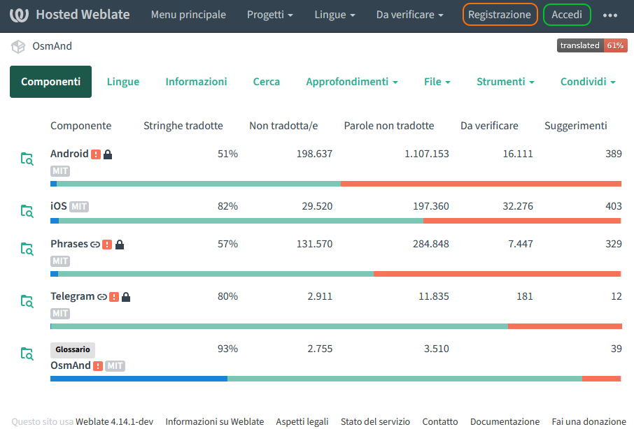
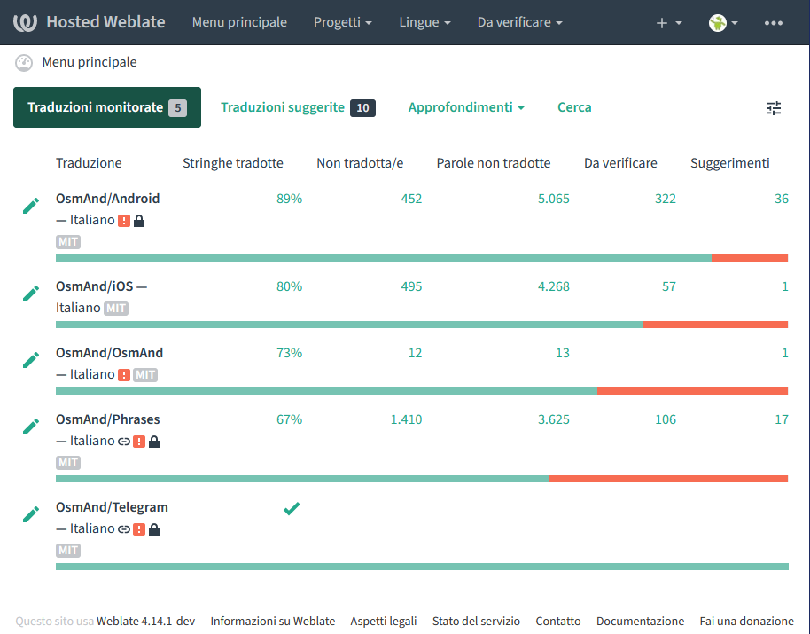
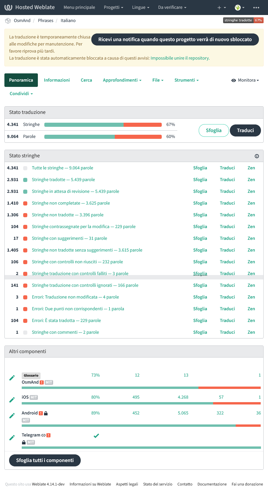
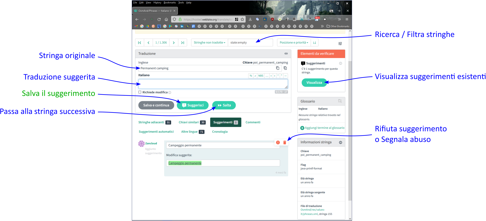

# TRADURRE IN ITALIANO L'INTERFACCIA UTENTE

<b><i>Ho notato che nell'interfaccia utente ci sono alcuni errori di traduzione; altre parti, invece, sono ancora
scritte in Inglese. Posso fare qualcosa per sistemare il problema?</i></b>

La traduzione dell'interfaccia utente è aperta a tutti gli utenti che desiderano contribuire. Chiunque può farlo, attraverso la piattaforma Hosted Weblate; Ecco come:
- Aprire la pagina web https://hosted.weblate.org/projects/osmand/ in un qualsiasi browser:

- Se si dispone già di un account, selezionane la voce Accedi, nella parte superiore destra della schermata, diversamente occorre crearne uno: a tale scopo, fare click su Registrazione; Verranno
richieste le seguenti informazioni:

  - Un indirizzo Email valido 
 
  - Il nome utente che si desidera utilizzare
 
  - Nome e cognome (quest'informazione non sarà resa pubblica)
 
  - Risposta ad una domanda di sicurezza anti-spam
  
  In alternativa, si può eseguire l'accesso con un account già esistente su una piattaforma tra quelle supportate (Google, Facebook, Github, ecc.)

- Una volta eseguito l'accesso, ci si trova nella pagina principale dedicata alla traduzione dell'interfaccia utente di OsmAnd.
Sono elencate alcune aree principali: in particolare, in /Android e /iOS si trova la traduzione dei testi per gli specifici Sistemi Operativi, mentre le altre (/OsmAnd e /Phrases) sono destinate a testi comuni a tutte le versioni; La sezione /Telegram, è invece dedicata alla traduzione del plugin di OsmAnd che consente di condividere la propria posizione in tempo reale con altri utenti attraverso messaggi istantanei sulla piattaforma Telegram.

- Fare click sul nome dell'area nella quale si desidera intervenire, ad esempio Phrases; selezionare quindi la lingua che interessa (Italiano).
- Viene mostrata una schermata che riassume lo stato attuale della traduzione (in rosso, le parti mancanti). Nonostante vi sia l'avviso che “la traduzione è temporaneamente chiusa alle modifiche per
manutenzione”, è comunque possibile inviare i propri suggerimenti: verranno presi in considerazione in
vista di un futuro rilascio.

- Fare click sulla sezione che si desidera modificare, ad esempio _Stringhe non tradotte_; si accede così all'elenco dei testi che necessitano di traduzione o di revisione; Digitare il proprio suggerimento e quindi inviarlo tramite il pulsante Suggerisci . 

 
<b>ATTENZIONE:</b>

In certi casi può capitare che la stringa da tradurre contenga dei caratteri speciali come “%” e/o “$”: in questo caso occorre prestare la massima attenzione a non modificarli, o l'interfaccia grafica mostrerà informazioni non corrette.

 
*Esempio:*

&nbsp;&nbsp;_Are you sure you want to delete "%1$s" group and all included points (%2$d)_

In questo caso, la traduzione suggerita è:

&nbsp;&nbsp;_Vuoi davvero eliminare il gruppo "%1$s" e tutti i punti che contiene (%2$d)_

 
*Significato dei caratteri speciali:*

  - _%_  &nbsp;&nbsp;&nbsp;&nbsp;   identifica un parametro: %1 è il primo del messaggio, %2 il secondo, ecc.
  - _$_  &nbsp;&nbsp;&nbsp;&nbsp;   indica quale tipo d'informazione andrà stampato: $d = Numero, $s = Testo, ecc.
  
   
  
<b>Suggerimenti per una corretta stesura della traduzione:</b>

- Cercare di capire qual è il contesto in cui il programma visualizza la stringa che si sta traducendo.

- Comprendere il senso della frase, facendo attenzione a lettere maiuscole, minuscole e segni di punteggiatura. Nella frase riportata sopra, ad esempio, OsmAnd formula una domanda, chiedendo conferma all'utente prima di eliminare un oggetto; Tuttavia, come si può notare, manca il punto interrogativo finale: il programma lo aggiunge infatti in modo automatico. Inserendolo nella traduzione, il periodo stampato durante l'esecuzione ne conterrebbe due (il che è errato).

- Non limitarsi ad una traduzione letterale: il risultato potrebbe essere poco leggibile o, peggio, poco comprensibile.

- Se possibile, fare in modo che il messaggio tradotto abbia lunghezza simile a quello originale: una stringa troppo lunga potrebbe infatti non essere contenuta nel riquadro ad esso destinato.

- Evitare di tradurre in modo troppo generico, troppo particolareggiato o con termini troppo specifici. Ricordare sempre che il destinatario della traduzione è un utente che ha bisogno di capire il significato dei messaggi ma il più delle volte non ha particolari competenze tecniche o scientifiche!

- L'applicazione deve aiutare l'utente e non ostacolarlo; L'interfaccia utente non dev'essere da
meno, poiché è il solo metodo di comunicazione tra l'utente ed il programma.

