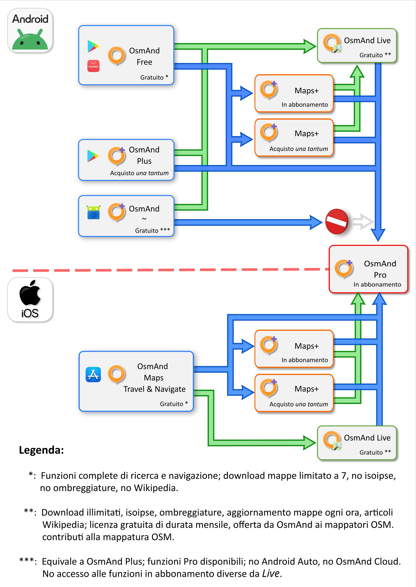

# OSMAND

## INFORMAZIONI SU OSMAND

### _**Cos'è OsmAnd?**_

**OsmAnd è un'app per Android e iOS** in grado di visualizzare le mappe di OpenStreetMap con una ricchezza di dettagli unica. 

Non solo: è un navigatore molto ricco di funzioni! Ad esempio, se ti imbatti in qualcosa di interessante che non è segnato sulla cartina, con OsmAnd puoi creare un Punto D'Interesse e aggiungerlo tu stesso alla mappa, così diventerà visibile a tutti gli utenti.

Se vuoi conoscere meglio quest'app, trovi tutto quello che serve sul sito https://osmand.net; la documentazione ufficiale è fatta davvero bene e vale sicuramente la pena leggerla, visto che ora è disponibile anche in lingua Italiana!
 

Tutte queste funzioni rendono OsmAnd apparentemente complicato: in realtà si tratta di un programma molto "tecnico" che riesce a dare il meglio di sè nelle mani di utenti esperti.

Imparare ad usarlo non è difficile, soprattutto se si ha a disposizione uno strumento come la <a href="https://www.guidaosmand.org/Download/" target="_blank">Guida!</a>

 

### _**Che cos'è OsmAnd Free?**_

**OsmAnd Free è la versione gratuita** di OsmAnd.

Tutte le funzioni principali di navigazione, la registrazione dei viaggi, la creazione di Punti D'Interesse, gli stili di rappresentazione cartografica ed il salvataggio della configurazione su Cloud sono utilizzabili liberamente ma <u>c'è una limitazione nel numero di mappe</u> che puoi installare: questa versione permette infatti di eseguire solo 7 (sette) download dal menu _**/// -> Mappe e risorse**_.

Per via di questo limite non potrai utilizzare alcune funzioni come la rappresentazione delle linee isoipse e dell'ombreggiatura dei rilievi, che richiedono di scaricare dei pacchetti aggiuntivi.

 

### ***Che cos'è OsmAnd+ ?***

**OsmAnd+ è la versione completa, a pagamento, di OsmAnd per Android**, distribuita in forma di app *stand-alone*: una volta acquistata da Google Play Store la potrai installare come qualsiasi altra app ed avrai accesso a tutte le funzionalità di OsmAnd, comprese le linee isoipse, l'ombreggiatura dei rilievi, la rappresentazione delle pendenze del terreno, le note di viaggio e la descrizione (offline) di tutti i Punti D'Interesse presenti in Wikipedia.

*OsmAnd+* ha una <u>licenza d'uso perpetua</u>: una volta tua, lo sarà per sempre!

 

### ***Che cos'è Maps+ ?***

**Maps+ è la versione completa, a pagamento, di OsmAnd per iOS e Android**, che puoi ottenere come upgrade di OsmAnd Free (OsmAnd Maps, in iOS), tramite l'installazione di una licenza, dal menu /// -> Impostazioni -> Acquisti.

Puoi ottenere Maps+ con 2 formule d'acquisto:

 - Abbonamento annuale, da rinnovarsi allo scadere;
 - Pagamento una tantum, con licenza a vita; quest'ultima equivale in tutto e per tutto ad OsmAnd+.

 

### ***Che cos'è OsmAnd~ ? È legale installarlo?***

**OsmAnd~ è una versione alternativa di OsmAnd+** distribuita dallo store *F-Droid* (https://f-droid.org), dal quale si possono scaricare gratuitamente moltissime app *OpenSource*.
 

Installare i pacchetti da F-Droid **è assolutamente legale**: il team che si occupa della loro preparazione, infatti, compila una nuova versione dell'app a partire dal codice sorgente messo a disposizione dagli autori e la ridistribuisce attenendosi alle medesime condizioni imposte dalla licenza d'uso *Open* originale.

F-Droid vaglia il codice originale ed elimina da esso qualsiasi elemento si appoggi a parti di software non OpenSource: può quindi capitare, a volte, che alcune funzionalità delle omologhe versioni “ufficiali” non siano presenti nelle “build” risultanti.

***OsmAnd~* offre all'utente, in modo gratuito, tutte le funzioni di OsmAnd+**, più alcune che sarebbero disponibili solo abbonandosi al servizio Pro, come gli aggiornamenti orari della mappa, il rendering 3D dei rilievi montuosi e le previsioni meteo; <u>purtroppo, però, vi sono alcuni inconvenienti</u>: la sincronizzazione dati da e verso il Cloud e la connessione a sistemi Android Auto non funzionano: nel primo caso la feature è stata rimosssa da F-Droid in quanto basata su librerie software non *Free*; nel secondo, invece, la “colpa” è di Android Auto, che non riconosce *OsmAnd~* come app avviabile.

 

 
> #### SUGGERIMENTO: 
> *Se si sceglie di utilizzare OsmAnd~ conviene innanzitutto installare l'app ufficiale di F-Droid, ottenibile dalla pagina web dello Store; si potrà così sfogliare l'intero catalogo delle app Open disponibili, installare quelle desiderate e ricevere notifiche quando vi fossero degli aggiornamenti.*

  

### ***Dove posso scaricare l'app?***
Puoi ottenere OsmAnd Free da diverse sorgenti. 

La **versione per Android** è quella che offre più possibilità:
 - <a href="https://play.google.com/store/apps/details?id=net.osmand" target="_blank">Google Play Store</a>
 - <a href="https://appgallery.huawei.com/#/app/C101486545" target="_blank">Huawei App Gallery</a>
 - <a href="https://f-droid.org/it/packages/net.osmand.plus" target="_blank">F-Droid</a>

 
La **versione per iOS** è invece reperibile solo su <a href="https://apps.apple.com/it/app/osmand-mappe-gps-offline/id934850257" target="_blank">Apple App Store</a>.

 

**OsmAnd+** è acquistabile solo da <a href="https://play.google.com/store/search?q=osmand%20plus" target="_blank">Google Play Store</a>

 

Per maggiori informazioni sulle varie possibilità di utilizzo *Free* ed a pagamento, puoi consultare sia la <a href="https://osmand.net/docs/intro" target="_blank">Documentazione</a> che la <a href="https://www.guidaosmand.org/Download/" target="_blank">Guida Non Ufficiale</a>.

  

## POSSIBILITA' DI UPGRADE

### ***Ho provato la versione Free e vorrei passare ad una completa. Quali sono le possibilità ed i costi?

Ci sono diverse possibilità per passare da OsmAnd Free ad una versione a pagamento: **sono riassunte nello schema qui sotto**.

### ***Ci sono anche altri servizi aggiuntivi?

Certo! oltre alle versioni *Free* e *Plus/Maps+*, ci sono anche **altri servizi che attivabili in abbonamento**.

Per maggiori informazioni puoi consultare la Guida oppure la pagina della <a href="https://osmand.net/it/docs/user/purchases" target="_blank">Documentazione Ufficiale</a> e/o il tutorial su OsmAnd Cloud Start, Pro e Live, su questo sito.

Vi sono inoltre moltissime risorse create da comunità di utenti, che puoi trovare online: se t'interessa questa parte, prova a dare un'occhiata alla sezione <a href="https://www.guidaosmand.org/Risorse/" target="_blank">Risorse</a> di questo sito!

