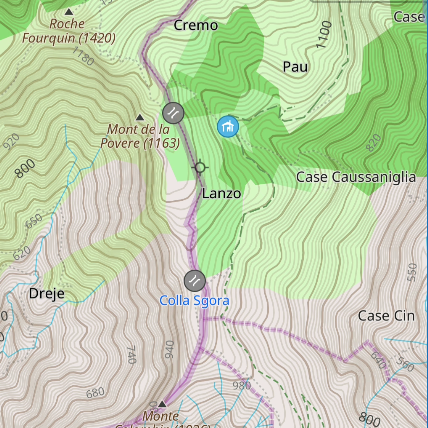
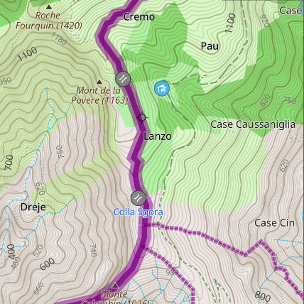
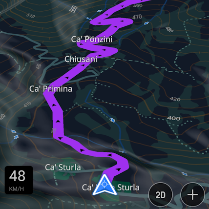
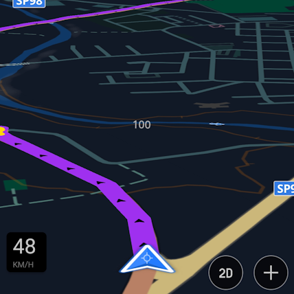

-> <a href="./it_highlighted_boundaries.md"><i>Italiano &ensp;</i></a>

# **Highlighted Admin Boundaries**
Map rendering style based on OsmAnd (default), with more highlighted Administrative Boundaries, for an improved visibility.

<table>
<thead>
	<tr>
		<th>OsmAnd Default</th>
		<th>Highlighted Boundaries</th>
	</tr>
</thead>
<tbody>
	<tr>
	    <td></td>
		<td></td></td>
	</tr>
	<tr>
	<td></td>
	<td>Download file: 
<a href="Highlighted Boundaries.render.xml">Highlighted Boundaries.render.xml</a>
</td>
	</tr>
	</tr>
</tbody>
</table>

# **Highlighted AB & Night View**
More highlighted Admin Boundaries, as in the previous style; in addition, the route trail is more visible and easily recognizable in Night Mode.

<table>
<thead>
	<tr>
		<th>OsmAnd Default - Night</th>
		<th>Highlighted AB & Night View - Night</th>
	</tr>
</thead>
<tbody>
	<tr>
	    <td></td>
		<td></td></td>
	</tr>
		<tr>
	    <td></td>
		<td></td></td>
	</tr>
	<tr>
	<td></td>
	<td>Download file: 
<a href="Highlighted AB & Night View.render.xml">Highlighted AB & Night View</a>
</td>
	</tr>
	</tr>
</tbody>
</table>

## How to install:
* Get the full path of the OsmAnd Storage directory from menu ***/// -> Settings -> OsmAnd Settings -> Data storage folder)***;
* Download the desired file on your device;
* Copy the file in the OsmAnd storage directory;
* On Android devices: from the Home screen, open the Recent Apps list and remove OsmAnd from there (if present);
* Start OsmAnd;
* Open menu */// -> Configure map -> Map Style*;
* Select style *Highlighted Boundaries* or *Highlighted AB & Night View* from the list.
