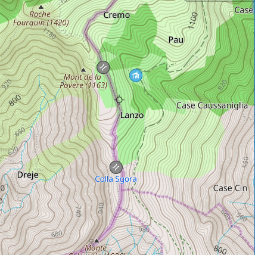
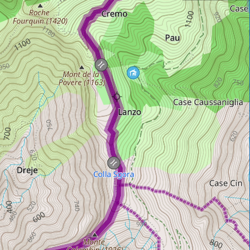
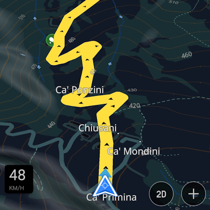
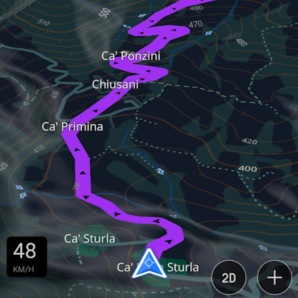
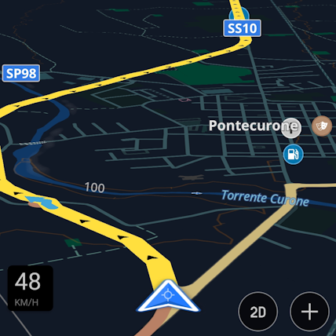
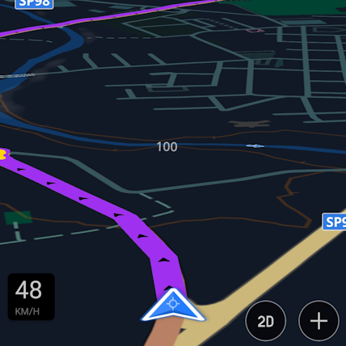

-> <a href="./en_highlighted_boundaries.md"><i>English &ensp;</i></a>

# **Highlighted Admin Boundaries**
Stile di rendering basato su OsmAnd (default): I confini amministrativi sono più marcati, per una migliore visibilità.

<table>
<thead>
	<tr>
		<th>OsmAnd Default</th>
		<th>Highlighted Boundaries</th>
	</tr>
</thead>
<tbody>
	<tr>
	    <td></td>
		<td></td></td>
	</tr>
	<tr>
	<td></td>
	<td>Scarica file: 
<a href="Highlighted Boundaries.render.xml">Highlighted Boundaries.render.xml</a>
</td>
	</tr>
	</tr>
</tbody>
</table>

# **Highlighted AB and Night View**
Come nel precedente, i confini amministrativi sono più marcati, inoltre l'itinerario in modalità Notte è più visibile.

<table>
<thead>
	<tr>
		<th>OsmAnd Default - Notte</th>
		<th>Highlighted Boundaries v.2 - Notte</th>
	</tr>
</thead>
<tbody>
	<tr>
	    <td></td>
		<td></td></td>
	</tr>
	<tr>
	    <td></td>
		<td></td></td>
	</tr>
	<tr>
	<td></td>
	<td>Scarica file: 
<a href="Highlighted Admin Borders v2.render.xml">Highlighted Admin Borders v2.render.xml</a>
</td>
	</tr>
	</tr>
</tbody>
</table>

## Come installare:
* Prendere nota del percorso della directory di salvataggio dati impostata in OsmAnd;   
(menu /// -> Impostazioni -> Impostazioni OsmAnd -> Cartella salvataggio dei dati);
* Scaricare il file *Highlighted Boundaries.render.xml* sul proprio dispositivo;
* Copiare il file nella directory di salvataggio dati di OsmAnd;
* Se si utilizza un dispositivo Android: dalla schermata Home, richiamare l'elenco delle app recenti ed eliminare OsmAnd dalla lista (se presente);
* Avviare OsmAnd;
* Aprire il menu */// -> Configura la mappa -> Stile della mappa*;
* Selezionare *Highlighted Boundaries* dalla lista degli stili disponibili.

